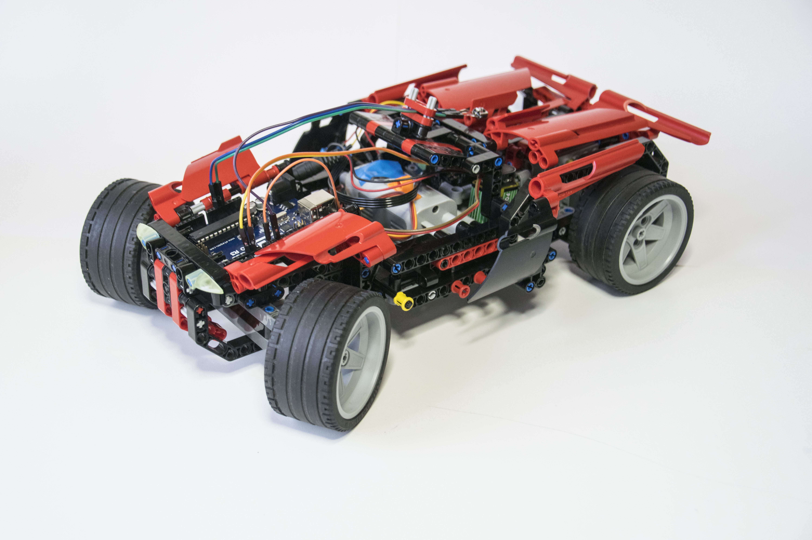

# Lego car controlled with IR
As optional project for the Reti Logiche course me and [Giorgia Benci](https://www.linkedin.com/in/giorgia-benci-1a4912186/) have created with Legos a remote controlled car that uses an Arduino Uno on board to control the electronic components, in particular a DC motor, a servomotor and a IR receiver. The remote control is performed using a Wii Nunchuk connected to an Arduino Uno that communicates with the car through an infrared LED. The main feature is that to control the car it can be used ether the joystick or the accelerometers of the Wii Nunchuk. 

The Lego instructions are available [here](./LDD_files/Instructions), while the Lego Digital Designer 3D models can be found [here](./LDD_files/Models). The Arduino software developed is organized in the dedicated folders: [remote](./IRremote), [car](/IRlegocar).

***For Italian users*:** the complete documentation can be found [here](./Documentation).

## Demo video

To see the prototype in action and for more details about the system configuration watch the [video tutorial](https://youtu.be/qfQm9lA7alI).
